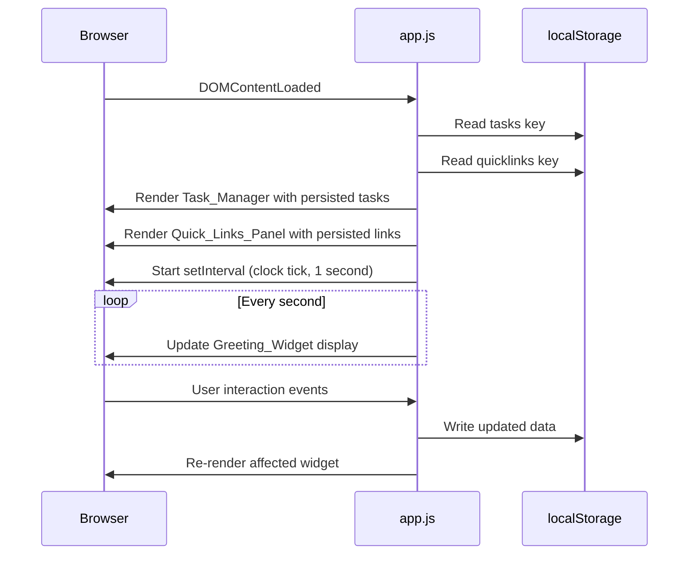
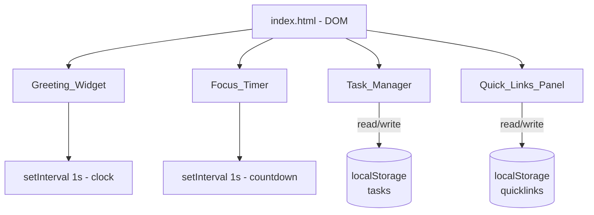

# Design Document: To-Do List Life Dashboard

## Overview

The To-Do List Life Dashboard is a self-contained, client-side single-page web application built with vanilla HTML, CSS, and JavaScript. It requires no build tools, no backend, and no external runtime dependencies. The application runs directly from the filesystem via `file://` or any static HTTP server.

The application composes four independent widgets rendered inside a single `index.html`:

| Widget | Responsibility |
|---|---|
| `Greeting_Widget` | Live HH:MM:SS clock, full date, and time-of-day greeting |
| `Focus_Timer` | 25-minute Pomodoro countdown with Start / Stop / Reset |
| `Task_Manager` | CRUD to-do list with LocalStorage persistence |
| `Quick_Links_Panel` | User-defined URL shortcuts (max 20) with LocalStorage persistence |

All user data (tasks and quick links) is persisted exclusively in `localStorage`. No cookies, no `sessionStorage`, no network calls.

---

## Architecture

### High-Level Structure

```
index.html          — HTML shell; imports css/style.css and js/app.js
css/style.css       — All styling; responsive grid + widget styles
js/app.js           — All application logic; single IIFE module
```

The application follows a **module pattern** — everything is wrapped in an IIFE (Immediately Invoked Function Expression) inside `app.js` to avoid polluting the global scope. Internal state is managed through plain JavaScript objects. There is no virtual DOM and no reactive framework.

### Execution Flow



### Component Interaction Diagram



### Design Decisions

**No framework / no build step**: The requirement to work via `file://` with exactly three files (`index.html`, `css/style.css`, `js/app.js`) rules out module bundlers and ES module imports (which require a server for CORS). An IIFE wrapping all logic is the standard vanilla approach.

**DOM as the source of truth for UI, `localStorage` as the source of truth for data**: On each user action the data array is mutated, serialized to `localStorage`, and the relevant DOM section is re-rendered from the array. This keeps a clear separation between data and display.

**No in-memory clock state for Focus_Timer**: The timer stores only the `remainingSeconds` integer and the `intervalId`. It does not track wall-clock time, which keeps the implementation simple and avoids drift correction complexity.

---

## Components and Interfaces

### Greeting_Widget

**Responsibilities**: Display HH:MM:SS time, full date, and greeting string.

**DOM elements**:
- `#greeting-message` — text node updated every tick
- `#clock-time` — text node showing HH:MM:SS
- `#clock-date` — text node showing full date

**Functions**:
```
initGreetingWidget() → void
  Starts a setInterval that fires every 1000 ms.
  On each tick calls updateGreeting().

updateGreeting() → void
  Gets current Date, formats time and date strings,
  determines greeting bucket, updates DOM nodes.

formatTime(date: Date) → string
  Returns HH:MM:SS zero-padded string.

formatDate(date: Date) → string
  Returns "Weekday, DD Month YYYY" string.

getGreeting(hour: number) → string
  hour 5–11  → "Good Morning"
  hour 12–17 → "Good Afternoon"
  hour 18–20 → "Good Evening"
  hour 21–23 or 0–4 → "Good Night"
```

---

### Focus_Timer

**Responsibilities**: 25-minute Pomodoro countdown; Start / Stop / Reset controls; end-of-session alert.

**State**:
```js
{
  remainingSeconds: number,  // starts at 1500
  intervalId: number | null  // null when not running
}
```

**DOM elements**:
- `#timer-display` — shows MM:SS
- `#timer-start` — Start button
- `#timer-stop` — Stop button
- `#timer-reset` — Reset button
- `#timer-alert` — hidden alert div, shown on countdown completion

**Functions**:
```
initFocusTimer() → void
  Sets remainingSeconds = 1500, renders display,
  sets Start enabled / Stop disabled.

startTimer() → void
  Sets intervalId = setInterval(tickTimer, 1000).
  Disables Start, enables Stop.

stopTimer() → void
  Clears intervalId, sets it to null.
  Enables Start, disables Stop.

resetTimer() → void
  Calls stopTimer(), sets remainingSeconds = 1500,
  hides alert, renders display.

tickTimer() → void
  Decrements remainingSeconds by 1.
  Calls renderTimerDisplay().
  If remainingSeconds === 0: calls stopTimer(), shows alert.

renderTimerDisplay() → void
  Formats remainingSeconds as MM:SS, sets #timer-display text.

formatTimerDisplay(seconds: number) → string
  Returns zero-padded MM:SS string.
```

---

### Task_Manager

**Responsibilities**: Add, display, inline-edit, complete-toggle, delete tasks; persist to `localStorage`.

**Data model** (stored in `localStorage` under key `"dashboard_tasks"`):
```js
[
  {
    id: string,           // crypto.randomUUID() or Date.now().toString()
    description: string,  // trimmed, 1–500 chars
    completed: boolean
  },
  ...
]
```

**DOM elements**:
- `#task-input` — text input, maxlength="500"
- `#task-add-btn` — Add button
- `#task-validation-msg` — inline error message span
- `#task-list` — `<ul>` container; each `<li>` is one task

**Task list item structure**:
```html
<li data-id="{id}" class="task-item [completed]">
  <input type="checkbox" class="task-toggle" [checked] />
  <span class="task-description">{description}</span>
  <button class="task-edit-btn">Edit</button>
  <button class="task-delete-btn">Delete</button>
</li>
```

**Edit mode replaces the span/buttons with**:
```html
<input type="text" class="task-edit-input" maxlength="500" value="{description}" />
<button class="task-save-btn">Save</button>
<button class="task-cancel-btn">Cancel</button>
```

**Functions**:
```
initTaskManager() → void
  Loads tasks from localStorage, renders list, attaches event listeners.

loadTasks() → Task[]
  Reads "dashboard_tasks" from localStorage.
  Returns [] on parse error or missing key.

saveTasks(tasks: Task[]) → void
  Serializes tasks array to JSON, writes to localStorage.
  On StorageError: displays inline storage-error message.

renderTaskList(tasks: Task[]) → void
  Clears #task-list, renders one <li> per task.

addTask(description: string) → void
  Validates non-empty after trim.
  Creates Task object, appends to array, calls saveTasks, re-renders.

toggleTask(id: string) → void
  Finds task by id, flips completed, calls saveTasks, re-renders.

enterEditMode(id: string) → void
  Checks no other task is in edit mode (enforced by class flag).
  Replaces task-item inner HTML with edit controls.

saveEdit(id: string, newValue: string) → void
  If trimmed newValue is empty: calls cancelEdit.
  Otherwise: updates description, calls saveTasks, re-renders.

cancelEdit(id: string) → void
  Re-renders task list (discards edit DOM state).

deleteTask(id: string) → void
  Removes task from array, calls saveTasks, re-renders.
```

---

### Quick_Links_Panel

**Responsibilities**: Add, display, delete URL shortcuts (max 20); persist to `localStorage`.

**Data model** (stored under key `"dashboard_quicklinks"`):
```js
[
  {
    id: string,
    label: string,   // trimmed, 1–100 chars
    url: string      // trimmed, starts with http:// or https://, ≤2048 chars
  },
  ...
]
```

**DOM elements**:
- `#ql-label-input` — text input, maxlength="100"
- `#ql-url-input` — text input, maxlength="2048"
- `#ql-add-btn` — Add Link button
- `#ql-validation-msg` — inline error message span
- `#ql-list` — container for Quick_Link buttons

**Quick_Link item structure**:
```html
<div class="ql-item">
  <a href="{url}" target="_blank" rel="noopener noreferrer"
     class="ql-btn">{label}</a>
  <button class="ql-delete-btn" data-id="{id}">×</button>
</div>
```

**Validation rules** (checked in order):
1. Label is non-empty after trim, ≤100 chars
2. URL is non-empty after trim, ≤2048 chars
3. URL starts with `http://` or `https://`
4. URL not already present in list
5. List count < 20

**Functions**:
```
initQuickLinksPanel() → void
  Loads links from localStorage, renders panel, attaches event listeners.

loadLinks() → QuickLink[]
  Reads "dashboard_quicklinks" from localStorage.
  Returns [] on parse error or missing key.

saveLinks(links: QuickLink[]) → void
  Serializes to JSON, writes to localStorage.
  On StorageError: displays inline error, retains link in panel.

renderLinks(links: QuickLink[]) → void
  Clears #ql-list, renders one .ql-item per link.

validateLink(label: string, url: string, existingLinks: QuickLink[]) → string | null
  Returns null on success, or a user-readable error string.

addLink(label: string, url: string) → void
  Calls validateLink; on error shows message and returns.
  Creates QuickLink object, appends to array, calls saveLinks, re-renders.

deleteLink(id: string) → void
  Removes link from array, calls saveLinks, re-renders.
```

---

### Storage Module

A thin wrapper around `localStorage` to centralise error handling:

```
storageRead(key: string) → string | null
  Returns localStorage.getItem(key).
  On SecurityError / exception: returns null.

storageWrite(key: string, value: string) → boolean
  Calls localStorage.setItem(key, value).
  Returns true on success, false on QuotaExceededError or other exception.
```

---

## Data Models

### Task

```js
{
  id:          string,   // unique identifier
  description: string,   // 1–500 trimmed characters
  completed:   boolean   // false = pending, true = done
}
```

`localStorage` key: `"dashboard_tasks"` — JSON array of Task objects.

### QuickLink

```js
{
  id:    string,   // unique identifier
  label: string,   // 1–100 trimmed characters
  url:   string    // starts with http:// or https://, ≤2048 trimmed characters
}
```

`localStorage` key: `"dashboard_quicklinks"` — JSON array of QuickLink objects.

### ID Generation

```js
const generateId = () =>
  (typeof crypto !== 'undefined' && crypto.randomUUID)
    ? crypto.randomUUID()
    : Date.now().toString(36) + Math.random().toString(36).slice(2);
```

`crypto.randomUUID()` is available in all modern browsers and in `file://` contexts. The fallback covers very old or sandboxed environments.

---

## Correctness Properties

*A property is a characteristic or behavior that should hold true across all valid executions of a system — essentially, a formal statement about what the system should do. Properties serve as the bridge between human-readable specifications and machine-verifiable correctness guarantees.*

### Property 1: Greeting bucket is exhaustive and mutually exclusive

*For any* integer hour value in [0, 23], `getGreeting(hour)` SHALL return exactly one of {"Good Morning", "Good Afternoon", "Good Evening", "Good Night"}. The four time ranges [5–11], [12–17], [18–20], [21–23, 0–4] are exhaustive (every hour maps to a result) and mutually exclusive (no hour maps to two results).

**Validates: Requirements 1.3, 1.4, 1.5, 1.6**

---

### Property 2: Clock time format round-trip

*For any* `Date` object, `formatTime(date)` SHALL produce a string matching the pattern `HH:MM:SS` (two-digit zero-padded hours, minutes, seconds) such that parsing hours, minutes, and seconds back from the string yields values consistent with the original `Date.getHours()`, `Date.getMinutes()`, and `Date.getSeconds()`.

**Validates: Requirements 1.1**

---

### Property 3: Timer display format round-trip

*For any* integer `seconds` in [0, 1500], `formatTimerDisplay(seconds)` SHALL produce a string matching `MM:SS` such that `parseInt(MM) * 60 + parseInt(SS)` equals the original `seconds` value.

**Validates: Requirements 2.3, 2.5**

---

### Property 4: Reset from any state always restores 25:00

*For any* `remainingSeconds` value in [0, 1500] (including mid-countdown states), calling `resetTimer()` SHALL set `remainingSeconds` to 1500 and cause `formatTimerDisplay` to produce `"25:00"`, regardless of the starting value.

**Validates: Requirements 2.5**

---

### Property 5: Valid task descriptions are accepted and grow the list

*For any* task array state and any description string whose trimmed value has length in [1, 500], calling `addTask(description)` SHALL increase the task array length by exactly one, the new task SHALL have `completed = false`, and the new task's description SHALL equal the trimmed input.

**Validates: Requirements 3.2**

---

### Property 6: Whitespace-only and empty task descriptions are rejected

*For any* string whose trimmed value is empty (empty string, or composed entirely of Unicode whitespace), calling `addTask` with that input SHALL leave the task array length unchanged and SHALL NOT write a new entry to `localStorage`.

**Validates: Requirements 3.3**

---

### Property 7: Task persistence round-trip

*For any* array of Task objects serialized via `saveTasks`, a subsequent call to `loadTasks` SHALL return an array deeply equal to the original — same length, same `id`, `description`, and `completed` values for every element, in the same order.

**Validates: Requirements 3.5, 3.6, 5.4, 5.5, 8.2, 8.3**

---

### Property 8: Completion toggle is an involution

*For any* task with any `completed` value, toggling the completion state twice SHALL return the task to its original `completed` value (i.e., `toggle(toggle(task)).completed === task.completed`).

**Validates: Requirements 5.1, 5.2**

---

### Property 9: Task deletion removes exactly one entry

*For any* non-empty task array, calling `deleteTask(id)` for an existing task id SHALL produce an array whose length is exactly one less than before, and that id SHALL NOT appear in any element of the resulting array.

**Validates: Requirements 5.3**

---

### Property 10: Valid Quick_Link inputs are accepted and persisted

*For any* label string (non-blank, ≤100 chars) and URL string (starts with `http://` or `https://`, ≤2048 chars, not already in the list) submitted when the list has fewer than 20 items, calling `addLink` SHALL increase the links array length by exactly one, and a subsequent `loadLinks` SHALL return an entry with the same label and URL.

**Validates: Requirements 6.2, 6.5, 6.6**

---

### Property 11: Quick_Link validation rejects all invalid inputs

*For any* input combination that violates at least one validation rule — blank label, blank URL, URL not starting with `http://` or `https://`, label exceeding 100 chars, URL exceeding 2048 chars, a URL already present in the list, or the list already containing 20 items — `validateLink` SHALL return a non-null, non-empty error string and the links array SHALL remain unchanged.

**Validates: Requirements 6.3, 6.7**

---

### Property 12: Quick_Link deletion removes exactly one entry permanently

*For any* non-empty links array, calling `deleteLink(id)` for an existing id SHALL produce an array whose length is exactly one less than before, and that id SHALL NOT appear in any element of the resulting array or in a subsequent `loadLinks` call.

**Validates: Requirements 7.2, 7.3**

---

## Error Handling

| Scenario | Detection | Response |
|---|---|---|
| `localStorage` unavailable on load | `storageRead` returns null / throws | Render empty state for both Task_Manager and Quick_Links_Panel; show inline warning banner |
| `localStorage` parse error (corrupt JSON) | `JSON.parse` throws | Treat as empty; log error to console; render empty state |
| `localStorage` write fails (quota exceeded or security error) | `storageWrite` returns false | Show inline error message in the affected widget; do not revert in-memory state (data is still live for the session) |
| Empty task submission | Description is empty or whitespace after trim | Show inline validation message below input; do not add task |
| Empty/invalid quick-link submission | `validateLink` returns non-null | Show specific error message below the form |
| Duplicate URL | `validateLink` detects existing URL | Show "This URL is already in the panel" error |
| Quick links at capacity | Array length === 20 | Show "Maximum of 20 links reached" error; disable Add Link button |
| Timer reaching 00:00 | `remainingSeconds === 0` in `tickTimer` | Clear interval; show `#timer-alert` div with "Session complete!" message |
| Edit mode conflict | Another task already has `.editing` class | Silently ignore the second edit activation |

---

## Testing Strategy

### Unit Tests (Example-Based)

These verify specific, concrete behaviors:

- `getGreeting(hour)` returns the correct string for each boundary: 5, 12, 18, 21, 0, 4
- `formatTime` pads single-digit hours, minutes, seconds correctly (e.g., `09:05:03`)
- `formatDate` returns the expected locale string for a known date
- `formatTimerDisplay(0)` returns `"00:00"`, `formatTimerDisplay(1500)` returns `"25:00"`, `formatTimerDisplay(65)` returns `"01:05"`
- `validateLink` returns the correct error string for each invalid input type
- `loadTasks` returns `[]` when `localStorage` is empty or contains invalid JSON
- Timer Start disables Start button and enables Stop button; Stop does the inverse
- Reset restores `remainingSeconds` to 1500 and hides the alert element

### Property-Based Tests

Property-based tests use **fast-check** (available via CDN or npm), the standard PBT library for JavaScript. Each test runs a minimum of **100 iterations** with randomly generated inputs.

**Test tag format**: `Feature: todo-list-life-dashboard, Property {N}: {property_text}`

| Property | Generator Inputs | Assertion |
|---|---|---|
| **P1** — Greeting bucket exhaustive | `fc.integer({min:0, max:23})` | Result is one of the four valid strings; no hour is unmapped |
| **P2** — Clock time format round-trip | `fc.date()` | Output matches `/^\d{2}:\d{2}:\d{2}$/`; parsed h/m/s equal original `getHours()/getMinutes()/getSeconds()` |
| **P3** — Timer display format round-trip | `fc.integer({min:0, max:1500})` | `parseInt(MM)*60 + parseInt(SS) === s` |
| **P4** — Reset always restores 25:00 | `fc.integer({min:0, max:1500})` | After `resetTimer()`, `remainingSeconds === 1500` |
| **P5** — Valid task accepted and grows list | `fc.array(taskArb)`, `fc.string().filter(s=>s.trim().length>=1 && s.trim().length<=500)` | `newList.length === oldList.length + 1`; last item `completed === false` |
| **P6** — Whitespace tasks rejected | `fc.stringMatching(/^\s*$/)` | List length and `localStorage` unchanged |
| **P7** — Task persistence round-trip | `fc.array(taskArb)` | `loadTasks()` after `saveTasks(arr)` deep-equals `arr` |
| **P8** — Toggle is involution | `taskArb` | `toggle(toggle(task)).completed === task.completed` |
| **P9** — Task deletion removes exactly one | `fc.array(taskArb, {minLength:1})`, pick random id | Length decreases by 1; id absent from result |
| **P10** — Valid link accepted and persisted | `fc.record({label: labelArb, url: urlArb})`, list with < 20 items | List grows by 1; `loadLinks()` contains entry with same label/url |
| **P11** — Invalid link rejected | Generators for each invalid variant (blank, bad prefix, duplicate, over-length, at-capacity) | `validateLink` returns non-null string; list unchanged |
| **P12** — Link deletion removes exactly one permanently | `fc.array(linkArb, {minLength:1})`, pick random id | Length decreases by 1; id absent from `loadLinks()` |

### Integration Checks (Manual or Automated with Playwright)

These verify the full wiring of the app in a real browser:

1. **Page load with existing `localStorage` data** — tasks and links render correctly before any interaction
2. **Page load with empty `localStorage`** — empty states render; no errors in console
3. **Page load with corrupt `localStorage`** — warning banner visible; empty states render
4. **Timer reaches 00:00** — alert element is visible; Start is re-enabled; display shows 00:00
5. **Cross-browser smoke test** — app loads without console errors in Chrome, Firefox, Edge, Safari
6. **Responsive layout** — no horizontal overflow at 320px and 2560px viewport widths
7. **`file://` protocol** — all features work without a web server

### Accessibility Checks

- All interactive controls have accessible labels (`aria-label` or visible label)
- Focus management: after adding a task the input field receives focus
- Edit mode: the edit input is focused when entering edit mode
- Timer alert uses `role="alert"` so screen readers announce it automatically
- Color contrast meets WCAG 2.1 AA for all text/background pairs
